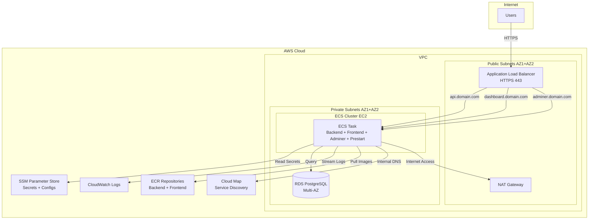
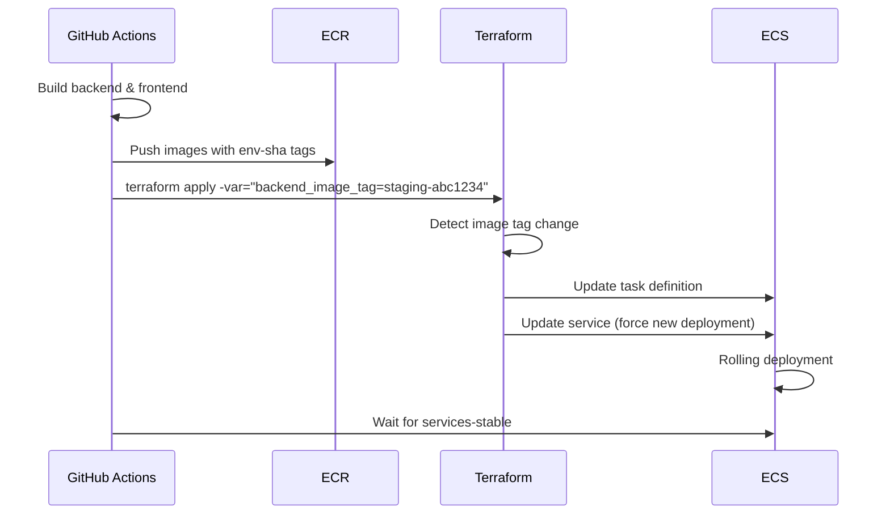

# ECS Terraform Infrastructure Migration Plan

## Architecture Overview




## Phase 1: Terraform Infrastructure Setup

### 1.1 Create Infrastructure Directory Structure

Create `[infrastructure/](github/digico-fullstack-template/infrastructure/)` in the repository root:

```
infrastructure/
├── main.tf                    # Root orchestrator
├── variables.tf               # Variable definitions
├── outputs.tf                 # Output definitions (ALB DNS, RDS endpoint, etc.)
├── versions.tf                # Provider versions + S3 backend config
├── locals.tf                  # Common locals, tagging, naming conventions
├── data.tf                    # Data sources (AMI, availability zones)
├── modules/
│   ├── networking/            # VPC, subnets, route tables, NAT
│   ├── compute/               # ECS cluster, EC2 capacity provider, ASG
│   ├── load-balancer/         # ALB, target groups, listeners
│   ├── database/              # RDS, DB subnet groups, Secrets Manager
│   ├── security/              # Security groups, IAM roles/policies
│   ├── service-discovery/     # AWS Cloud Map for internal DNS
│   ├── ecr/                   # ECR repositories
│   └── monitoring/            # CloudWatch log groups, alarms
└── environments/
    ├── staging/
    │   ├── terraform.tfvars   # Staging-specific values
    │   └── backend.hcl        # Staging state backend config
    └── production/
        ├── terraform.tfvars   # Production-specific values
        └── backend.hcl        # Production state backend config
```

**Key file**: `[infrastructure/main.tf](github/digico-fullstack-template/infrastructure/main.tf)` will orchestrate all modules.

### 1.2 Networking Module

**File**: `[infrastructure/modules/networking/main.tf](github/digico-fullstack-template/infrastructure/modules/networking/main.tf)`

Use `terraform-aws-modules/vpc/aws` module (v5.x) to create:

- VPC with configurable CIDR
- 2 public subnets (AZ1, AZ2) for ALB and NAT
- 2 private subnets (AZ1, AZ2) for ECS tasks and RDS
- Internet Gateway for public subnets
- NAT Gateway in public subnet for private subnet internet access
- Route tables configured appropriately

**Variables to expose**:

- `vpc_cidr` (default: `10.0.0.0/16`)
- `public_subnet_cidrs` (default: `["10.0.1.0/24", "10.0.2.0/24"]`)
- `private_subnet_cidrs` (default: `["10.0.10.0/24", "10.0.11.0/24"]`)

### 1.3 Security Module

**File**: `[infrastructure/modules/security/main.tf](github/digico-fullstack-template/infrastructure/modules/security/main.tf)`

Use `terraform-aws-modules/security-group/aws` (v5.x) for:

**ALB Security Group**:

- Ingress: 443 from `0.0.0.0/0`
- Ingress: 80 from `0.0.0.0/0` (for redirect)
- Egress: All to ECS security group

**ECS Security Group**:

- Ingress: 8000 (backend), 80 (frontend), 8080 (adminer) from ALB security group
- Egress: 443 to internet (for pulling images, external APIs)
- Egress: 5432 to RDS security group

**RDS Security Group**:

- Ingress: 5432 from ECS security group only
- No egress needed

**IAM Roles** (using `terraform-aws-modules/iam/aws//modules/iam-assumable-role`):

1. **ECS Task Execution Role**: Allows ECS to pull images and read SSM parameters
  - Policies: `AmazonECSTaskExecutionRolePolicy`, custom policy for SSM Parameter Store access
2. **ECS Task Role**: Allows application code to access AWS services
  - Policies: SSM read access, S3 access (if needed), CloudWatch Logs write
3. **ECS EC2 Instance Role**: Allows EC2 instances to join ECS cluster
  - Policies: `AmazonEC2ContainerServiceforEC2Role`, `AmazonSSMManagedInstanceCore`

### 1.4 Database Module

**File**: `[infrastructure/modules/database/main.tf](github/digico-fullstack-template/infrastructure/modules/database/main.tf)`

Use `terraform-aws-modules/rds/aws` (v6.x) to create:

- RDS PostgreSQL 18 instance
- DB subnet group using private subnets
- Random password generation for master user
- Secrets Manager secret storing credentials
- CloudWatch logs export (postgresql, upgrade)

**Key configuration**:

```hcl
engine                = "postgres"
engine_version        = "18"
instance_class        = var.rds_instance_class
allocated_storage     = var.rds_allocated_storage
max_allocated_storage = var.rds_allocated_storage * 2
storage_encrypted     = true
multi_az              = var.rds_multi_az
publicly_accessible   = false
backup_retention_period = var.rds_backup_retention_days
deletion_protection   = var.environment == "production"
```

**Store in SSM Parameter Store**:

- `/[environment]/[project]/database/host`
- `/[environment]/[project]/database/port`
- `/[environment]/[project]/database/name`
- `/[environment]/[project]/database/username`
- `/[environment]/[project]/database/password` (SecureString)

### 1.5 ECR Module

**File**: `[infrastructure/modules/ecr/main.tf](github/digico-fullstack-template/infrastructure/modules/ecr/main.tf)`

Create ECR repositories using `terraform-aws-modules/ecr/aws` or native resources:

- `[project]-[environment]-backend`
- `[project]-[environment]-frontend`

**Features**:

- Image scanning on push
- Lifecycle policy: keep last 10 images, expire untagged after 14 days
- Encryption at rest

### 1.6 Service Discovery Module

**File**: `[infrastructure/modules/service-discovery/main.tf](github/digico-fullstack-template/infrastructure/modules/service-discovery/main.tf)`

Create AWS Cloud Map namespace for internal service communication:

- Private DNS namespace: `[project]-[environment].local`
- Service discovery services for backend, db (if containerized)

This enables services to communicate via DNS names like `backend.project-staging.local` instead of IPs.

### 1.7 Compute Module (ECS on EC2)

**File**: `[infrastructure/modules/compute/main.tf](github/digico-fullstack-template/infrastructure/modules/compute/main.tf)`

**ECS Cluster**:

- Use native `aws_ecs_cluster` resource
- Enable Container Insights for monitoring

**Launch Template**:

- ECS-optimized AMI (use data source for latest)
- Instance type from variable (e.g., `t3.medium`)
- User data script:
  ```bash
  #!/bin/bash
  echo ECS_CLUSTER=[cluster-name] >> /etc/ecs/ecs.config
  ```
- IAM instance profile with ECS EC2 role

**Auto Scaling Group**:

- Use `terraform-aws-modules/autoscaling/aws` (v7.x)
- Min/desired/max instances (start with 1/1/3)
- Attach to private subnets
- EC2 capacity provider with managed scaling

**ECS Task Definition** (multi-container):

Based on current `[compose.yml](github/digico-fullstack-template/compose.yml)`, create task definition with 4 containers:

**IMPORTANT**: Use `var.backend_image_tag` and `var.frontend_image_tag` for image references:

```hcl
# In task definition
container_definitions = jsonencode([
  {
    name      = "prestart"
    image     = "${module.ecr.backend_repository_url}:${var.backend_image_tag}"
    essential = false
    command   = ["bash", "scripts/prestart.sh"]
    # ... environment, secrets, logs
  },
  {
    name      = "backend"
    image     = "${module.ecr.backend_repository_url}:${var.backend_image_tag}"
    essential = true
    portMappings = [{ containerPort = 8000 }]
    dependsOn = [{ containerName = "prestart", condition = "SUCCESS" }]
    healthCheck = {
      command = ["CMD-SHELL", "curl -f http://localhost:8000/api/v1/utils/health-check/ || exit 1"]
    }
    # ... environment, secrets, logs
  },
  {
    name      = "frontend"
    image     = "${module.ecr.frontend_repository_url}:${var.frontend_image_tag}"
    essential = true
    portMappings = [{ containerPort = 80 }]
    # ... environment, logs
  },
  {
    name      = "adminer"
    image     = "adminer:latest"
    essential = false
    portMappings = [{ containerPort = 8080 }]
    # ... environment, logs
  }
])
```

This allows Terraform to detect image changes and update the task definition automatically when `backend_image_tag` or `frontend_image_tag` changes.

**Task networking**:

- Bridge or awsvpc mode (recommend awsvpc for better security)
- If awsvpc: assign security group, ENI in private subnets

**ECS Service**:

- Desired count: 1 (start conservative)
- Launch type: EC2
- Load balancer integration: attach all 3 target groups
- Service discovery: register in Cloud Map
- Deployment config:
  - `minimum_healthy_percent: 50`
  - `maximum_percent: 200`
- Health check grace period: 180s

### 1.8 Load Balancer Module

**File**: `[infrastructure/modules/load-balancer/main.tf](github/digico-fullstack-template/infrastructure/modules/load-balancer/main.tf)`

Use `terraform-aws-modules/alb/aws` (v9.x):

**Application Load Balancer**:

- Internet-facing
- Public subnets
- ALB security group
- Access logs to S3 (optional but recommended)

**Target Groups**:

1. **Backend TG**:
  - Protocol: HTTP, Port: 8000
  - Health check: `/api/v1/utils/health-check/`
  - Stickiness: none
2. **Frontend TG**:
  - Protocol: HTTP, Port: 80
  - Health check: `/`
  - Stickiness: none
3. **Adminer TG**:
  - Protocol: HTTP, Port: 8080
  - Health check: `/`
  - Stickiness: none

**HTTPS Listener (443)**:

- ACM certificate: `*.${var.domain}` (must be created manually or via ACM module)
- Default action: Fixed response 404

**Listener Rules** (host-based routing):

- `api.${var.domain}` → Backend TG
- `dashboard.${var.domain}` → Frontend TG
- `adminer.${var.domain}` → Adminer TG

**HTTP Listener (80)**:

- Redirect to HTTPS

### 1.9 Monitoring Module

**File**: `[infrastructure/modules/monitoring/main.tf](github/digico-fullstack-template/infrastructure/modules/monitoring/main.tf)`

**CloudWatch Log Groups**:

- `/ecs/[project]-[environment]/backend`
- `/ecs/[project]-[environment]/frontend`
- `/ecs/[project]-[environment]/adminer`
- `/ecs/[project]-[environment]/prestart`

Retention: 7 days (staging), 30 days (production)

**CloudWatch Alarms** (optional but recommended):

- ECS service CPU > 80%
- ECS service memory > 80%
- ALB target unhealthy count > 0
- RDS CPU > 80%
- RDS storage < 20%

### 1.10 Root Terraform Files

`**[infrastructure/variables.tf](github/digico-fullstack-template/infrastructure/variables.tf)**`:

Key variables from `[.env](github/digico-fullstack-template/.env)`:

```hcl
variable "aws_region" {
  description = "AWS region for all resources"
  type        = string
}

variable "environment" {
  description = "Environment name (staging, production)"
  type        = string
}

variable "project" {
  description = "Project name"
  type        = string
  default     = "full-stack-fastapi-project"
}

variable "domain" {
  description = "Base domain for the application"
  type        = string
}

variable "frontend_host" {
  description = "Frontend URL for email links"
  type        = string
}

# Backend configs
variable "secret_key" {
  description = "Secret key for JWT tokens"
  type        = string
  sensitive   = true
}

variable "first_superuser" {
  description = "Email for first superuser"
  type        = string
}

variable "first_superuser_password" {
  description = "Password for first superuser"
  type        = string
  sensitive   = true
}

variable "backend_cors_origins" {
  description = "Allowed CORS origins (comma-separated)"
  type        = string
}

# SMTP configs
variable "smtp_host" { type = string, default = "" }
variable "smtp_user" { type = string, default = "" }
variable "smtp_password" { type = string, default = "", sensitive = true }
variable "emails_from_email" { type = string }
variable "smtp_tls" { type = bool, default = true }
variable "smtp_ssl" { type = bool, default = false }
variable "smtp_port" { type = number, default = 587 }

# Sentry
variable "sentry_dsn" { type = string, default = "" }

# Infrastructure sizing
variable "vpc_cidr" { type = string, default = "10.0.0.0/16" }
variable "ec2_instance_type" { type = string, default = "t3.medium" }
variable "ecs_desired_count" { type = number, default = 1 }

variable "rds_instance_class" { type = string, default = "db.t3.micro" }
variable "rds_allocated_storage" { type = number, default = 20 }
variable "rds_multi_az" { type = bool, default = false }
variable "rds_backup_retention_days" { type = number, default = 7 }

variable "common_tags" {
  type = map(string)
  default = {}
}

# Docker image tags (passed from CI/CD)
variable "backend_image_tag" {
  description = "Docker image tag for backend (e.g., staging-abc1234)"
  type        = string
  default     = "latest"
}

variable "frontend_image_tag" {
  description = "Docker image tag for frontend (e.g., staging-abc1234)"
  type        = string
  default     = "latest"
}
```

`**[infrastructure/versions.tf](github/digico-fullstack-template/infrastructure/versions.tf)**`:

```hcl
terraform {
  required_version = ">= 1.5.0"

  required_providers {
    aws = {
      source  = "hashicorp/aws"
      version = "~> 5.0"
    }
    random = {
      source  = "hashicorp/random"
      version = "~> 3.6"
    }
  }

  backend "s3" {
    bucket       = "digico-fullstack-tfstate-bucket"
    region       = "us-east-1"  # Configurable
    use_lockfile = true
    # key is passed via -backend-config per environment
  }
}
```

`**[infrastructure/locals.tf](github/digico-fullstack-template/infrastructure/locals.tf)**`:

```hcl
locals {
  context = {
    project     = var.project
    environment = var.environment
    region      = var.aws_region
    common_tags = merge(
      var.common_tags,
      {
        Environment = var.environment
        Project     = var.project
        ManagedBy   = "terraform"
      }
    )
  }

  # Naming convention
  name_prefix = "${var.project}-${var.environment}"
}
```

`**[infrastructure/outputs.tf](github/digico-fullstack-template/infrastructure/outputs.tf)**`:

```hcl
output "alb_dns_name" {
  description = "DNS name of the ALB"
  value       = module.load_balancer.alb_dns_name
}

output "rds_endpoint" {
  description = "RDS instance endpoint"
  value       = module.database.rds_endpoint
}

output "ecr_backend_repository_url" {
  value = module.ecr.backend_repository_url
}

output "ecr_frontend_repository_url" {
  value = module.ecr.frontend_repository_url
}

output "ecs_cluster_name" {
  value = module.compute.ecs_cluster_name
}
```

### 1.11 Environment-Specific Configuration

`**[infrastructure/environments/staging/terraform.tfvars](github/digico-fullstack-template/infrastructure/environments/staging/terraform.tfvars)**`:

Copy all values from `[.env](github/digico-fullstack-template/.env)` and configure:

```hcl
aws_region  = "us-east-1"  # Configurable
environment = "staging"
project     = "full-stack-fastapi-project"

# Domain
domain        = "staging.example.com"
frontend_host = "https://dashboard.staging.example.com"

# Backend (from .env)
secret_key                 = "changethis"  # Use GitHub Secrets
first_superuser           = "admin@example.com"
first_superuser_password  = "changethis"   # Use GitHub Secrets
backend_cors_origins      = "https://dashboard.staging.example.com,https://api.staging.example.com"

# SMTP (from .env)
smtp_host         = ""
smtp_user         = ""
smtp_password     = ""
emails_from_email = "info@example.com"
smtp_tls          = true
smtp_ssl          = false
smtp_port         = 587

# Sentry (from .env)
sentry_dsn = ""

# Infrastructure sizing (staging: smaller)
ec2_instance_type        = "t3.small"
ecs_desired_count        = 1
rds_instance_class       = "db.t3.micro"
rds_allocated_storage    = 20
rds_multi_az            = false
rds_backup_retention_days = 1

common_tags = {
  Environment = "staging"
  Project     = "full-stack-fastapi-project"
  ManagedBy   = "terraform"
}
```

`**[infrastructure/environments/staging/backend.hcl](github/digico-fullstack-template/infrastructure/environments/staging/backend.hcl)**`:

```hcl
key = "staging/terraform.tfstate"
```

`**[infrastructure/environments/production/terraform.tfvars](github/digico-fullstack-template/infrastructure/environments/production/terraform.tfvars)**`:

Similar to staging but with production domains and larger resources:

```hcl
aws_region  = "us-east-1"  # Configurable
environment = "production"
domain      = "example.com"

# Larger infrastructure
ec2_instance_type        = "t3.medium"
rds_instance_class       = "db.t3.small"
rds_multi_az            = true
rds_backup_retention_days = 7
```

### 1.12 SSM Parameter Store Setup

Create Terraform resources to populate SSM parameters for ECS tasks:

**File**: `[infrastructure/ssm-parameters.tf](github/digico-fullstack-template/infrastructure/ssm-parameters.tf)`

All environment variables from `[.env](github/digico-fullstack-template/.env)` should be stored in SSM Parameter Store:

```hcl
# Application secrets (SecureString)
resource "aws_ssm_parameter" "secret_key" {
  name  = "/${var.environment}/${var.project}/SECRET_KEY"
  type  = "SecureString"
  value = var.secret_key
  tags  = local.context.common_tags
}

resource "aws_ssm_parameter" "first_superuser_password" {
  name  = "/${var.environment}/${var.project}/FIRST_SUPERUSER_PASSWORD"
  type  = "SecureString"
  value = var.first_superuser_password
  tags  = local.context.common_tags
}

resource "aws_ssm_parameter" "postgres_password" {
  name  = "/${var.environment}/${var.project}/POSTGRES_PASSWORD"
  type  = "SecureString"
  value = module.database.db_password
  tags  = local.context.common_tags
}

resource "aws_ssm_parameter" "smtp_password" {
  name  = "/${var.environment}/${var.project}/SMTP_PASSWORD"
  type  = "SecureString"
  value = var.smtp_password
  tags  = local.context.common_tags
}

# Application configs (String)
resource "aws_ssm_parameter" "domain" {
  name  = "/${var.environment}/${var.project}/DOMAIN"
  type  = "String"
  value = var.domain
  tags  = local.context.common_tags
}

resource "aws_ssm_parameter" "frontend_host" {
  name  = "/${var.environment}/${var.project}/FRONTEND_HOST"
  type  = "String"
  value = var.frontend_host
  tags  = local.context.common_tags
}

resource "aws_ssm_parameter" "first_superuser" {
  name  = "/${var.environment}/${var.project}/FIRST_SUPERUSER"
  type  = "String"
  value = var.first_superuser
  tags  = local.context.common_tags
}

resource "aws_ssm_parameter" "backend_cors_origins" {
  name  = "/${var.environment}/${var.project}/BACKEND_CORS_ORIGINS"
  type  = "String"
  value = var.backend_cors_origins
  tags  = local.context.common_tags
}

resource "aws_ssm_parameter" "emails_from_email" {
  name  = "/${var.environment}/${var.project}/EMAILS_FROM_EMAIL"
  type  = "String"
  value = var.emails_from_email
  tags  = local.context.common_tags
}

# Database connection (from RDS module)
resource "aws_ssm_parameter" "postgres_server" {
  name  = "/${var.environment}/${var.project}/POSTGRES_SERVER"
  type  = "String"
  value = module.database.rds_endpoint
  tags  = local.context.common_tags
}

resource "aws_ssm_parameter" "postgres_port" {
  name  = "/${var.environment}/${var.project}/POSTGRES_PORT"
  type  = "String"
  value = "5432"
  tags  = local.context.common_tags
}

resource "aws_ssm_parameter" "postgres_db" {
  name  = "/${var.environment}/${var.project}/POSTGRES_DB"
  type  = "String"
  value = module.database.db_name
  tags  = local.context.common_tags
}

resource "aws_ssm_parameter" "postgres_user" {
  name  = "/${var.environment}/${var.project}/POSTGRES_USER"
  type  = "String"
  value = module.database.db_username
  tags  = local.context.common_tags
}

# SMTP configs (optional)
resource "aws_ssm_parameter" "smtp_host" {
  count = var.smtp_host != "" ? 1 : 0
  name  = "/${var.environment}/${var.project}/SMTP_HOST"
  type  = "String"
  value = var.smtp_host
  tags  = local.context.common_tags
}

resource "aws_ssm_parameter" "smtp_user" {
  count = var.smtp_user != "" ? 1 : 0
  name  = "/${var.environment}/${var.project}/SMTP_USER"
  type  = "String"
  value = var.smtp_user
  tags  = local.context.common_tags
}

# Sentry (optional)
resource "aws_ssm_parameter" "sentry_dsn" {
  count = var.sentry_dsn != "" ? 1 : 0
  name  = "/${var.environment}/${var.project}/SENTRY_DSN"
  type  = "String"
  value = var.sentry_dsn
  tags  = local.context.common_tags
}
```

**ECS task definition references these via `secrets` block**:

```hcl
secrets = [
  { name = "SECRET_KEY", valueFrom = aws_ssm_parameter.secret_key.arn },
  { name = "FIRST_SUPERUSER_PASSWORD", valueFrom = aws_ssm_parameter.first_superuser_password.arn },
  { name = "POSTGRES_PASSWORD", valueFrom = aws_ssm_parameter.postgres_password.arn },
  # ... more secrets
]

environment = [
  { name = "DOMAIN", value = var.domain },
  { name = "ENVIRONMENT", value = var.environment },
  { name = "POSTGRES_SERVER", value = module.database.rds_endpoint },
  # ... non-sensitive configs can be env vars or from SSM
]
```

**Note**: Frontend never reads from SSM - all frontend env vars are baked into the Docker image at build time via `--build-arg`.

## Phase 2: GitHub Actions CI/CD Pipeline

### Architecture: Terraform-Managed Deployments (No Infrastructure Drift)

**Key principle**: GitHub Actions builds and tags Docker images, then passes image tags to Terraform. Terraform updates the ECS task definition and triggers deployment. This ensures Terraform state always matches reality.

**Image tagging convention**: `<environment>-<short-git-sha>`

- Staging: `staging-abc1234`
- Production: `production-abc1234`

**Deployment flow**:




## Phase 2: GitHub Actions CI/CD Pipeline

### 2.1 Update Infrastructure Deployment Workflow

**File**: `[.github/workflows/deploy-infrastructure.yml](github/digico-fullstack-template/.github/workflows/deploy-infrastructure.yml)`

Update paths to watch `infrastructure/**` instead of `infrastructure/terraform/**`:

```yaml
paths:
  - 'infrastructure/**'
```

Update working directory in all steps:

```yaml
run: |
  cd infrastructure
  terraform init -backend-config=environments/staging/backend.hcl
```

### 2.2 Update Staging Deployment Workflow

**File**: `[.github/workflows/deploy-staging.yml](github/digico-fullstack-template/.github/workflows/deploy-staging.yml)`

**CRITICAL CHANGE**: Do NOT update ECS task definitions directly via AWS CLI - this causes infrastructure drift. Instead, let Terraform manage deployments by passing image tags as variables.

**New workflow approach**:

```yaml
name: Deploy to Staging

on:
  push:
    branches:
      - master

jobs:
  deploy:
    if: github.repository_owner != 'fastapi'
    runs-on: ubuntu-latest
    env:
      AWS_REGION: ${{ secrets.AWS_REGION }}
      ECR_REGISTRY: ${{ secrets.AWS_ACCOUNT_ID }}.dkr.ecr.${{ secrets.AWS_REGION }}.amazonaws.com
      IMAGE_TAG: staging-${{ github.sha }}
      SHORT_SHA: ${{ github.sha }}

    steps:
      - name: Checkout
        uses: actions/checkout@v6

      - name: Configure AWS credentials
        uses: aws-actions/configure-aws-credentials@v4
        with:
          aws-access-key-id: ${{ secrets.AWS_ACCESS_KEY_ID }}
          aws-secret-access-key: ${{ secrets.AWS_SECRET_ACCESS_KEY }}
          aws-region: ${{ secrets.AWS_REGION }}

      - name: Login to Amazon ECR
        id: login-ecr
        uses: aws-actions/amazon-ecr-login@v2

      - name: Get short SHA
        id: vars
        run: echo "short_sha=$(echo ${GITHUB_SHA} | cut -c1-7)" >> $GITHUB_OUTPUT

      - name: Build and push backend image
        run: |
          docker build -t $ECR_REGISTRY/full-stack-fastapi-project-staging-backend:staging-${{ steps.vars.outputs.short_sha }} \
            -f backend/Dockerfile .
          docker push $ECR_REGISTRY/full-stack-fastapi-project-staging-backend:staging-${{ steps.vars.outputs.short_sha }}

      - name: Build and push frontend image
        env:
          VITE_API_URL: https://api.${{ secrets.DOMAIN_STAGING }}
        run: |
          docker build -t $ECR_REGISTRY/full-stack-fastapi-project-staging-frontend:staging-${{ steps.vars.outputs.short_sha }} \
            --build-arg VITE_API_URL=$VITE_API_URL \
            -f frontend/Dockerfile .
          docker push $ECR_REGISTRY/full-stack-fastapi-project-staging-frontend:staging-${{ steps.vars.outputs.short_sha }}

      - name: Setup Terraform
        uses: hashicorp/setup-terraform@v3
        with:
          terraform_version: 1.5.0

      - name: Terraform Init
        run: |
          cd infrastructure
          terraform init -backend-config=environments/staging/backend.hcl

      - name: Terraform Apply with new image tags
        run: |
          cd infrastructure
          terraform apply -auto-approve \
            -var-file=environments/staging/terraform.tfvars \
            -var="backend_image_tag=staging-${{ steps.vars.outputs.short_sha }}" \
            -var="frontend_image_tag=staging-${{ steps.vars.outputs.short_sha }}"

      - name: Wait for ECS deployment to stabilize
        run: |
          aws ecs wait services-stable \
            --cluster full-stack-fastapi-project-staging \
            --services full-stack-fastapi-project-staging-service

      - name: Verify deployment
        run: |
          SERVICE_STATUS=$(aws ecs describe-services \
            --cluster full-stack-fastapi-project-staging \
            --services full-stack-fastapi-project-staging-service \
            --query 'services[0].runningCount' \
            --output text)

          if [ "$SERVICE_STATUS" -lt "1" ]; then
            echo "Service is not running properly"
            exit 1
          fi

          echo "Deployment successful. Service running $SERVICE_STATUS tasks with image tag staging-${{ steps.vars.outputs.short_sha }}"
```

**Why this approach is better**:

- No infrastructure drift: Terraform state matches reality
- Atomic deployments: Terraform handles task definition + service update
- Easy rollbacks: `terraform apply` with previous image tag
- Audit trail: All changes tracked in Terraform state
- Version control: Image tags tied to Git commits

### 2.3 Update Production Deployment Workflow

**File**: `[.github/workflows/deploy-production.yml](github/digico-fullstack-template/.github/workflows/deploy-production.yml)`

Same approach as staging, but:

- Triggered on `release` publish
- Image tag format: `production-<short-sha>` or use release tag
- Uses `environments/production/terraform.tfvars` and `backend.hcl`

```yaml
name: Deploy to Production

on:
  release:
    types:
      - published

jobs:
  deploy:
    if: github.repository_owner != 'fastapi'
    runs-on: ubuntu-latest
    environment: production  # GitHub environment protection
    env:
      AWS_REGION: ${{ secrets.AWS_REGION }}
      ECR_REGISTRY: ${{ secrets.AWS_ACCOUNT_ID }}.dkr.ecr.${{ secrets.AWS_REGION }}.amazonaws.com
      IMAGE_TAG: production-${{ github.sha }}

    steps:
      # ... same as staging but with production config ...

      - name: Get short SHA
        id: vars
        run: echo "short_sha=$(echo ${GITHUB_SHA} | cut -c1-7)" >> $GITHUB_OUTPUT

      - name: Build and push images
        # ... build with production-$short_sha tag ...

      - name: Terraform Apply with new image tags
        run: |
          cd infrastructure
          terraform apply -auto-approve \
            -var-file=environments/production/terraform.tfvars \
            -var="backend_image_tag=production-${{ steps.vars.outputs.short_sha }}" \
            -var="frontend_image_tag=production-${{ steps.vars.outputs.short_sha }}"
```

### 2.4 Required GitHub Secrets

Document required secrets in `[infrastructure/README.md](github/digico-fullstack-template/infrastructure/README.md)`:

**AWS Credentials**:

- `AWS_ACCESS_KEY_ID`
- `AWS_SECRET_ACCESS_KEY`
- `AWS_REGION`
- `AWS_ACCOUNT_ID`

**ECS Cluster Names**:

- `ECS_CLUSTER_STAGING` (e.g., `full-stack-fastapi-project-staging`)
- `ECS_CLUSTER_PRODUCTION`
- `ECS_SERVICE_STAGING` (e.g., `full-stack-fastapi-project-staging-service`)
- `ECS_SERVICE_PRODUCTION`

**Domain Names**:

- `DOMAIN_STAGING`
- `DOMAIN_PRODUCTION`

**Application Secrets** (will be stored in SSM by Terraform, but need for initial apply):

- `SECRET_KEY`
- `FIRST_SUPERUSER_PASSWORD`
- `POSTGRES_PASSWORD` (can be auto-generated by Terraform)
- `SMTP_PASSWORD`

## Phase 3: Docker Compose for Local Development

### 3.1 Keep Existing Docker Compose Setup

**NO CHANGES** to:

- `[compose.yml](github/digico-fullstack-template/compose.yml)`
- `[compose.override.yml](github/digico-fullstack-template/compose.override.yml)`
- `[compose.traefik.yml](github/digico-fullstack-template/compose.traefik.yml)`

Developers continue to use:

```bash
docker compose up -d
```

### 3.2 Update Documentation

Update `[deployment.md](github/digico-fullstack-template/deployment.md)`:

- Add section at top: "For AWS ECS + Terraform deployment, see `[infrastructure/README.md](infrastructure/README.md)`"
- Keep existing Docker Compose + Traefik instructions as an alternative deployment option

## Phase 4: Documentation and Handoff

### 4.1 Create Infrastructure README

**File**: `[infrastructure/README.md](github/digico-fullstack-template/infrastructure/README.md)`

Comprehensive guide covering:

1. Prerequisites (AWS account, Terraform, S3 backend bucket)
2. Initial setup (create S3 bucket, configure backend)
3. Environment configuration (tfvars)
4. Manual steps (ACM certificate, Route53 hosted zone)
5. Deployment commands
6. GitHub Actions setup
7. Troubleshooting

### 4.2 Update Root README

**File**: `[README.md](github/digico-fullstack-template/README.md)`

Add deployment section:

- Local development: Docker Compose
- Staging/Production: AWS ECS (see `[infrastructure/README.md](infrastructure/README.md)`)

## Phase 5: Testing and Validation

### 5.1 Terraform Validation Checklist

Before applying:

- Run `terraform fmt -recursive`
- Run `terraform validate`
- Run `terraform plan` for staging
- Review plan output for correctness
- Verify resource naming conventions
- Check security group rules
- Verify IAM policies follow least privilege

### 5.2 Post-Deployment Validation

After first `terraform apply`:

- VPC created with correct CIDR
- 2 public + 2 private subnets in different AZs
- NAT Gateway operational
- RDS instance accessible from ECS security group
- ECR repositories created
- ALB listening on 443 with valid certificate
- ECS cluster created
- ECS service running with desired count
- Target groups healthy
- CloudWatch log groups receiving logs
- SSM parameters created and accessible

### 5.3 Application Validation

After first deployment:

- Access `https://api.[domain]/docs` → Backend API docs
- Access `https://dashboard.[domain]` → Frontend loads
- Access `https://adminer.[domain]` → Adminer loads
- Login with superuser credentials
- Backend can connect to RDS
- Database migrations ran successfully (prestart)
- CloudWatch logs showing application output
- Health checks passing on ALB

## Key Differences from Current Setup


| Aspect                | Current (Docker Compose)     | New (ECS + Terraform)                  |
| --------------------- | ---------------------------- | -------------------------------------- |
| **Orchestration**     | Docker Compose on single EC2 | ECS on EC2 with ALB                    |
| **HTTPS/Routing**     | Traefik                      | ALB with ACM certificate               |
| **Database**          | PostgreSQL container         | RDS PostgreSQL (managed)               |
| **Secrets**           | `.env` file                  | SSM Parameter Store                    |
| **Scaling**           | Manual (SSH + scale compose) | Auto Scaling Groups + ECS              |
| **Deployment**        | SSH + docker compose pull    | GitHub Actions → ECR → Terraform → ECS |
| **Monitoring**        | Docker logs                  | CloudWatch Logs + Container Insights   |
| **Networking**        | Docker bridge network        | VPC with public/private subnets        |
| **Service Discovery** | Docker DNS                   | AWS Cloud Map                          |
| **Infrastructure**    | Manual/Ansible               | Terraform (IaC)                        |


## Deployment Strategy (Greenfield)

**Recommended approach**: Deploy to staging first, then production

1. **Deploy staging infrastructure** with Terraform
2. **Configure GitHub Actions** secrets and workflows
3. **Test first deployment** to staging via GitHub Actions
4. **Verify all endpoints** (api, dashboard, adminer)
5. **Deploy production infrastructure** with Terraform
6. **Configure DNS** to point to ALB
7. **Deploy to production** via GitHub Actions (release)
8. **Monitor and validate** production deployment

For rollbacks: Use Terraform with previous image tags or `terraform destroy` + redeploy if needed.

## Estimated Costs (AWS)

**Staging** (minimal):

- EC2 t3.small (1 instance): ~$15/month
- RDS db.t3.micro (single AZ): ~$15/month
- ALB: ~$18/month
- NAT Gateway: ~$32/month
- Data transfer: ~$10/month
- **Total**: ~$90/month

**Production** (moderate):

- EC2 t3.medium (1-2 instances): ~$30-60/month
- RDS db.t3.small (Multi-AZ): ~$60/month
- ALB: ~$18/month
- NAT Gateway: ~$32/month
- Data transfer: ~$20/month
- **Total**: ~$160-190/month

Add 20% for CloudWatch, ECR storage, backups.

## Implementation Timeline

For a team to execute:

- **Phase 1** (Terraform setup): 3-5 days
- **Phase 2** (GitHub Actions): 1-2 days
- **Phase 3** (Documentation): 1 day
- **Phase 4** (Testing & validation): 2-3 days
- **Phase 5** (Production deployment): 1 day
- **Total**: 8-12 days

## Next Steps for Implementation

1. **Create Linear issues** from todos in plan frontmatter
2. **Assign infrastructure engineer(s)** to implement modules
3. **Set up AWS prerequisites**:
  - Create S3 bucket for Terraform state
  - Request ACM certificate for `*.domain.com`
  - Configure Route53 hosted zone
  - Set up AWS IAM user/role for GitHub Actions
4. **Implement infrastructure modules** (Phase 1)
5. **Configure GitHub Actions** secrets and workflows (Phase 2)
6. **Deploy and test staging environment**
7. **Deploy production environment** after staging validation
8. **Configure DNS** to point to production ALB

**Timeline**: 8-12 days for full implementation
